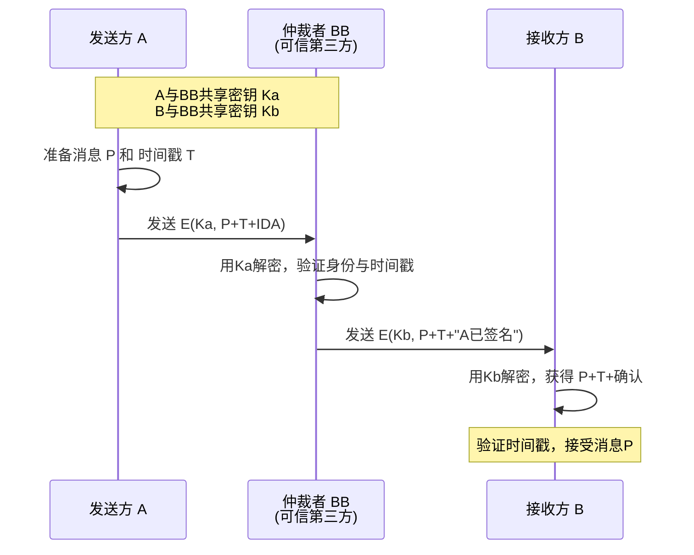

## 6.4-数字签名
数字签名系统向通信双方提供服务，使得A向B发送签名的信息P，以便达到以下几点: 
1. B可以验证信息P确实来源于A
2. A以后不能否认发送过信息B
3. B不能编造或改变信息P

 基于对称密钥的数字签名

- 前置条件
   - 发送方 A 与仲裁者 BB 共享一个对称密钥 ` K_a `
   - 接收方 B 与仲裁者 BB 共享另一个对称密钥 ` K_b `
   - **A 与 B 之间没有直接共享密钥**
- 签名与验证步骤
   - A 准备消息  P  和当前时间戳  $T$ ，防止重放攻击
   - A 用 ` K_a ` 加密 ` P + T + \text{自己的身份} `，发送给 BB
   - BB 用 ` K_a ` 解密，确认 A 的身份和消息完整性
   - BB 生成一条确认信息（例如“A 在时间 T 签发了 P”），并用 ` K_b ` 加密后发送给 B
   - B 用 ` K_b ` 解密，得到  P  和  T ，验证时间戳后接受消息

 基于非对称密钥的数字签名

